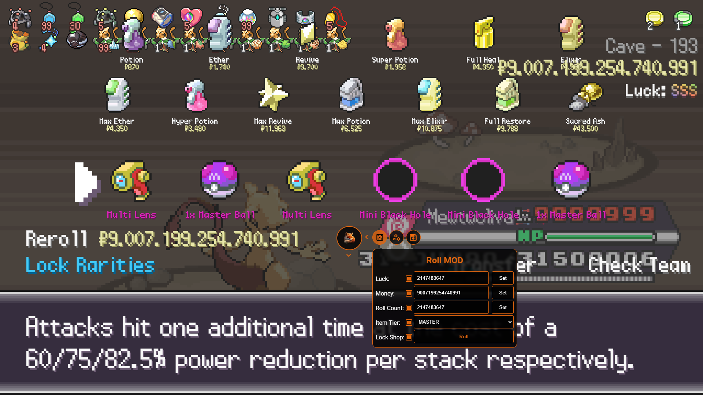

> [!IMPORTANT]  
> **The content of this repo is a proof of concept and is for educational purposes only!**

> [!CAUTION]
> This tool can cause your account to be flagged, I have had no problems so far, but be warned, you can read about it [here](https://www.reddit.com/r/pokerogue/comments/1d8ldlw/a_cheating_and_account_deletionwipe_followup/)!

> [!Note]
> Since there was some unnecessary drama regarding the so-called `RogueEditor`, I decided to just make my own account modification tool from scratch, based only on the [source code](https://github.com/pagefaultgames/pokerogue). My goal is to focus on adding new features that do not exist yet, with a nice **Graphical User Interface** (**GUI**).

# JsPoRoAnal
> Remember to be alert at all times. Stay aware of your surroundings.

Welcome to the JsPoRoAnal! This is the new Repo for everything related to JavaScript Hacks and tools. _(Readme needs to be updated soon...!)_

## [Discord Server](https://discord.gg/rsNPUcbrPT)

## [Video Tutorial](https://youtu.be/PAlSXXpj1LQ)

## `Supported OS`
- `macOS (?-14) Browser: [Safari, Chrome, Firefox]`
- `Android (?-14) Browser: [Kiwi]`
- `iOS (15-17) [Safari]`
- `Windows (10-11) [Chrome, Firefox]`
> `(Other versions not tested, they may work, you can try them!)`

## `Source Code`

### [`PokéRogue`](https://github.com/pagefaultgames/pokerogue/tree/main/src)

## `Other Tools / MODs`
### [`PyPoRoMOD - Python DEV version.`](https://github.com/PokeRogueMOD/PyPoRoMOD)

## `Other Hack / MODs`
- https://github.com/MikeyTheA/PokeRogueExtra
- https://github.com/MikeyTheA/PokeRogueModLoader

### Feature

> `(P)` = Partially implemented.  > `(N)` = Not implemented.

-   **hack.js**: All currently maintained hacks bundled in a GUI `(P)`.
-   **infinite_money_and_rolls.js**: Unlimited Rerolls with Max Cash and Max Luck.
-   **max_reroll_luck.js**: Sets the reroll luck to max and prevents the text from disappearing. (Runs once)
-   **enemy_team.js**: View both teams with name, stats and moves and get all the important battle data. (Runs once)
-   **and more...**

## Contact

If you have any questions, suggestions, or need further assistance, feel free to reach out (Discord: mpb.rip).

## License

This project is licensed under the BSD 3-Clause License - see the [LICENSE](LICENSE) file for details.

### Acknowledgments

-   This project uses [Loguru](https://github.com/Delgan/loguru) which is licensed under the MIT License.
